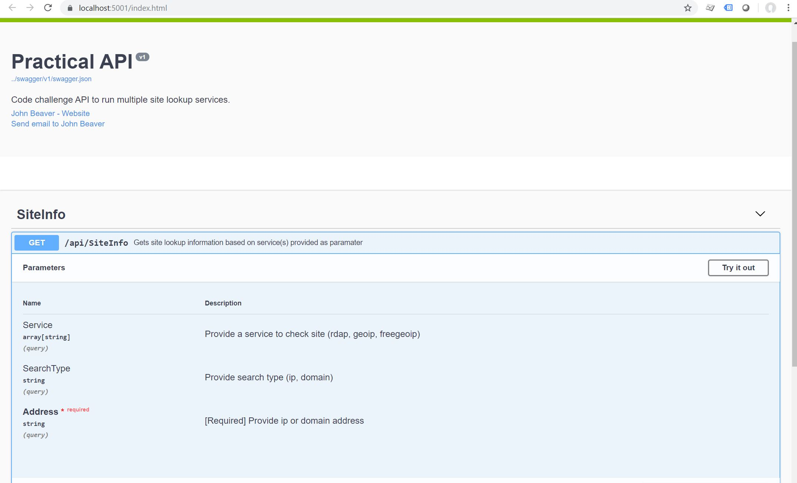

# Practical_1
API to provide 3rd party ip/domain lookup services. To meet the requirement that each call to an external service must be done on a separate proccesses/machines/docker containers, I have placed the calls to each external service that I have implemented behind an AWS Gateway API. In doing this I am hoping to demonstrate that its a very straight forward process to move the API Gateway integration request from an HTTP integration to a Lambda integration for example. So further development would progress from just calling an API endpoint for RDAP data, to enhancing our microservice to do additional data filtering/massaging before returning the results. 

## Solution Notes
Goal was to deploy Practical_1 using a serverless solution (AWs - API Gateway and Lambda). The Swagger UI (and deployed API) should be available via this [Practical API](https://o9i6moqr2f.execute-api.us-west-2.amazonaws.com/dev/index.html) link. While the API is deployed and operational a Swagger issue has occured when deploying my solution to AWS Lambda. My initial thoughts are that since Lambda deployment is via linux while my dev build is Windows, that there are some conflicts in the Swagger configuration that need to addressed. I want to solve this and am still investigating but am up against my deadline for submitting. The full Swagger UI does run locally as show below. To install locally follow make the prerequisites are installed and follow the steps to run locally.

## Prerequisites to run locally
You will need to ensure that .NET Core v2.1 is installed to run this project:
* [.NET Core](https://dotnet.microsoft.com/download/thank-you/dotnet-sdk-2.1.505-windows-x64-installer) - Windows (64-bit) 

## Run Project
After cloning or pulling the project 
* Move to Practical_1/src directory and run the following

      dotnet restore
      
      dotnet run
      
* Open browser window and navigate to the appropriate URL

      http://localhost:5000 for example locally this should display the Swagger UI
      
## Testing - Unit Tests
* Using **xUnit.net** for .NET Core. Simple unit test created for the API developed. Run via command line by going to Practical_1/tests directory and run

      dotnet test

## Tools Used
* .NET Core v2.1 (C#, .NET Core cli)
* Swagger
* xUnit
* VS Code
* AWS deployment tools (Amazon.Lambda.AspNetCoreServer, Amazon.Lambda.Tools)

## ToDo 
* Fix Swagger issue
* Demonstrate a Lambda integration request - return customized/filtered data from calling an external ip/domain lookup service
* With the Swagger sticking point I was unable to proper address complete error responses or address rate limit issues.

